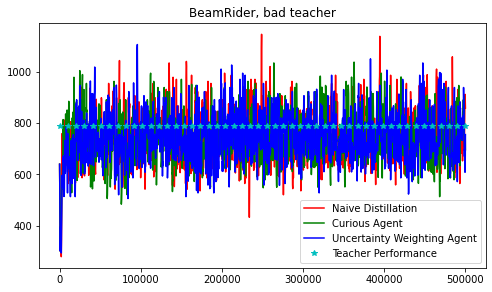
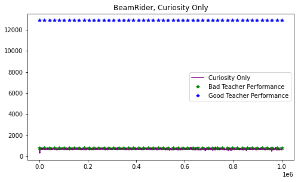
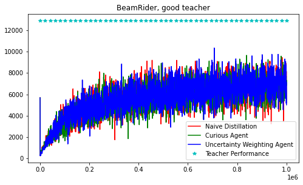
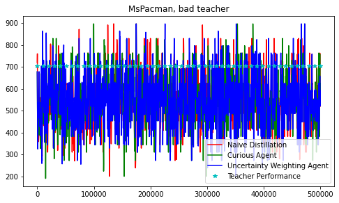
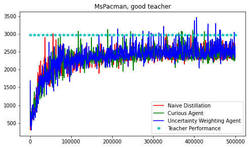
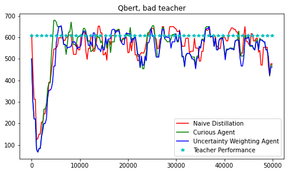
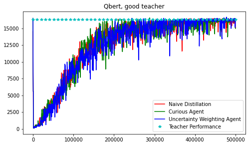

# Curiously Learning Task-Specific Skills via Distillation

This repository demonstrates an reward-free implementation of Rusu's [policy distillation](https://arxiv.org/abs/1511.06295) to improve the quality of students by using [Random Network Distillation](https://arxiv.org/abs/1810.12894) as a measure of novelty, to curiously explore during distillation.

The implementation is in **pytorch 1.10.0**, using **gym[atari]** and **atari-py**. Performance is evaluated in the environments: *BeamRiderNoFrameskip-v4*, *MsPacmanNoFrameskip-v4*, *QbertNoFrameskip-v4*. All other atari environments are supported.

# Requirements

### Windows

Install [swig](http://www.swig.org/download.html) by downloading the zip file for windows. Add the unzipped swig folder to your PATH.

### All systems

1. `pip install -r requirements.txt`
2. Run `pip install -e .`
3. Download [atari roms](http://www.atarimania.com/rom_collection_archive_atari_2600_roms.html)
4. `python -m atari_py.import_roms <path to unzipped roms folder>`
5. `ale-import-roms --import-from-pkg atari_py.atari_roms`

Note: the teacher was trained with python 3.8.10, on Ubuntu 20.04.3 LTS (64-bit), in a python venv populated using `requirements.txt`.

All commands are written to be executed from the base directory of this project (which contains the file `requirements.txt`).

# Training a teacher

In order to perform policy distillation, we must have a teacher for a student to learn from. We use [PPO](https://arxiv.org/abs/1707.06347) to train a teacher on the environment of choice for 40 million iterations. 

To train your own teacher on an environment using ppo, run the below command with arguments that represent the number of training timesteps:

    python trainppo.py --env {env_name} --n_iters {n_iters}

for example,

    python trainppo.py --env BeamRiderNoFrameskip-v4 --n_iters 40000000

This will generate a teacher checkpoint in `src/teachers/`.

# Evaluating a teacher

To evaluate the performance of a teacher, run `evalppo.py`:

    python evalppo.py {args}

arguments include:
- `--env`: environment name (required)
- `--teacher_chkpt`: path to teacher checkpoint, default is the latest teacher (required)
- `--n_eval_episodes`: number of evaluation episodes, default 10

## Teacher Performance

Teacher performance for many different n_iters has been evaluated and recorded in `evalppo_logs/evalppo.csv`. Each of these teachers has been saved to src/teachers.

# Running policy distillation

Running plain policy distillation will train a student with a smaller number of parameters to match a teacher.

To run standard policy distillation, run:

    python src/scripts/run_distillation.py {args}

arguments include:
- `--teacher_chkpt`: path to teacher checkpoint
- `--temperature`: softmax temperature for KL divergence

# Running policy distillation with curiosity and uncertainty

Running policy distillation using curiosity and teacher uncertainty to guide the student results in better performance with high quality teachers.

To run policy distillation with curiosity only, run:

    python src/scripts/run_distillation.py --use_curiosity {args}
    
To run policy distillation with uncertainty-guided curiosity, run:

    python src/scripts/run_distillation.py --use_uncertinaty {args}

(`--use_uncertainty` will automatically set the `--use_curiosity` flag to true.)

arguments include:
- `--teacher_chkpt`: path to teacher checkpoint
- `--temperature`: softmax temperature for KL divergence

# Results

We selected a good, medium, and bad teacher for each environment. These are marked with the use=TRUE flag in `evalppo_logs/evalppo_sorted.csv`. We evaluated distillation with the good and bad teacher on three environments.

## BeamRider

# Ms. Pac-Man

# Qbert

